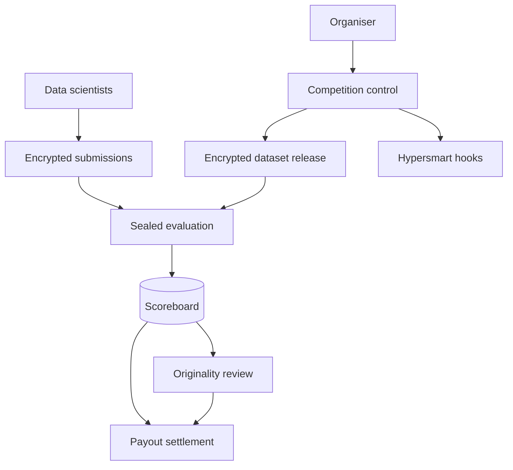

# Cipherquest

**Source:** `ai-in-decentralized+ai/decentralizedai-180428175529/`
**Domain:** `ai-decentralized`
**One-liner:** A weekly encrypted data-science competition desk where organisers release sealed datasets, data scientists submit encrypted models that keep their IP, and payouts rank by accuracy with originality bonuses.
**Wedge:** Quant funds, research labs, and data trusts running Numer.ai-style tournaments who need encrypted release, retained model IP, and auditable payouts — not another open Kaggle clone or federated training bounty.
**Positioning:** Marketplace competition ops from Geeta Chauhan’s SVSG Decentralized AI deck. The deck’s distinctive commercial block is the AI Marketplace (weekly data competition, encrypted data, crowdsourced models, Bitcoin payouts to top 60, originality paid extra) alongside hypersmart-contract triggers for supply-chain reverse auctions. Cipherquest productises the competition desk; hypersmart reverse-auction hooks are a secondary integration path — distinct from Fedbounty (federated validation lift) and Modelescrow (single-task escrow).

## Market research synthesis

### Thesis from source

The April 2018 SVSG talk frames Decentralized AI as the convergence of blockchain and AI across Federated AI, Data Exchange, AI Marketplace, and ai-in-blockchain. Federated learning is described as the Google Research pattern: selected devices download a model, train locally, return gradients, server aggregates. Blockchain is positioned as an immutable peer-shared ledger that replaces middlemen via smart contracts, DApps, and DAOs — enabling an “Internet of Value” for commerce, assets, data, and organisations. Homomorphic encryption and OpenMined appear as privacy primitives; Data Exchange emphasises provenance, user-owned data, time expiry, and ethically sourced data (transparency, fairness, privacy).

The sharpest product wedge in this earlier deck (before the DeepCloud Boston/IoTConf variants) is the AI Marketplace pattern explicitly modelled on Numer.ai: weekly competitions, encrypted data release, crowdsourced models, scientists retain IP via encrypted models, participants paid in Bitcoin by accuracy with payouts to the top 60, and originality paid extra. A parallel ai-in-blockchain lane activates AI off-chain from on-chain data for use cases such as supply-chain reverse auction and demand forecasting (ORS Group). Cipherquest centres the competition marketplace; it does not absorb full federated device training (Privybudget/Fedbounty territory) or agent autonomy control (Agentfence).

### Buyer & economic model

- **Primary buyer:** Head of Quant Research or ML Platform at a fund/lab that already buys external model signal and wants sealed competitions.
- **Users:** competition organisers, data stewards, competing data scientists, payout ops, originality reviewers, compliance.
- **Budget owner / value metric:** quality-adjusted cost per accepted model improvement and share of competitions that settle without IP disputes.
- **Competing status quo:** public Kaggle-style contests (data leakage, weak IP protection) or bilateral freelance contracts without ranked encrypted settlement.

### Domain constraints

- **Regulatory / trust / safety:** competition data may be market-sensitive or personal; encrypted release and time expiry are mandatory; payout rails must be lawful in the organiser’s jurisdiction.
- **Data sensitivity:** raw competition data must not be reconstructible by losers; models remain encrypted IP of submitters until licence terms say otherwise.
- **Change-management realities:** organisers will not migrate entire MLOps stacks; Cipherquest wraps weekly tournaments beside existing evaluation pipelines.

## Business requirements

- BR-1: Organisers must release competition data only in encrypted form with a published expiry, after which plaintext access is impossible by policy.
- BR-2: Submitted models must remain encrypted IP of the scientist by default; organisers receive scored artefacts under explicit licence, not blanket ownership.
- BR-3: Payouts must rank by published accuracy metrics with a configurable top-N cut (default 60) and a separate originality bonus pool.
- BR-4: Originality review must produce a documented ruling before originality bonuses settle, so “paid extra” is not discretionary chat.
- BR-5: Every competition week must publish an auditable scoreboard tying submissions to scores and payouts.
- BR-6: Data provenance and ethical-sourcing attestations (transparency, fairness, privacy) must be attachable to each dataset release.
- BR-7: Federated or local training modes may be optional, but the beachhead workflow is sealed competition — not mandatory on-device FL.
- BR-8: Optional hypersmart-contract hooks must allow an organiser to trigger off-chain scoring or reverse-auction workflows from on-chain events without storing raw competition data on-chain.
- BR-9: Participants must see fee and payout currency rules before submitting, with a single disclosed platform take-rate.
- BR-10: Disputed scores must enter a time-boxed challenge with access to the evaluation definition, not the sealed holdout in cleartext to challengers.
- BR-11: Time-expired datasets must be cryptographically and operationally unreadable, with a certificate organisers can show auditors.
- BR-12: Compliance must be able to block a competition that lacks lawful basis for the underlying data.

## User stories

Canonical user stories live in sibling [USER_STORIES.md](USER_STORIES.md).

## System design

### Overview

Cipherquest runs sealed ML competitions. Organisers register a competition week, attach an encrypted dataset with expiry and provenance, define scoring and payout rules (top-N + originality pool). Participants submit encrypted models; an evaluation worker scores against a sealed holdout; originality review may adjust bonus eligibility; payouts settle against the scoreboard. Optional smart-contract events can trigger scoring or reverse-auction side workflows without placing personal or competition plaintext on-chain.

### Actors & boundaries

- **Actors:** organisers, data scientists, stewards, originality reviewers, payout ops, compliance, platform operator.
- **Trust boundary:** sealed holdout and encryption keys are under organiser/policy control; the platform sees ciphertext, scores, and payouts — not default plaintext IP.
- **Human-in-the-loop points:** originality rulings, score challenges, compliance blocks, payout exceptions.

### Core capabilities

1. **Competition scheduling** — weekly (or custom) tournament lifecycle.
2. **Encrypted dataset release** — sealed publish, provenance, time expiry.
3. **Encrypted model submission** — IP-preserving artefact intake.
4. **Sealed evaluation and ranking** — accuracy scoring and top-N cut.
5. **Originality review** — bonus eligibility rulings.
6. **Payout settlement** — ranked and bonus payouts with statements.
7. **Challenge desk** — time-boxed score disputes.
8. **Optional hypersmart hooks** — event triggers for off-chain AI / reverse auction.

### Conceptual data

- **Primary entities:** Competition, EncryptedDataset, Submission, ScoreRecord, OriginalityRuling, Payout, Challenge, ProvenanceAttestation, HookSubscription.
- **Critical events:** dataset sealed/released/expired, submission received, scored, originality ruled, payout executed, challenge resolved, hook fired.
- **Retention / audit needs:** scoreboards and payouts retained for commercial audit; ciphertext artefacts per licence; plaintext never retained past expiry.

### Integrations (conceptual)

- **Systems of record:** organiser data vaults, participant wallets/payment rails, existing evaluation clusters.
- **Upstream signals:** provenance registries, OpenMined-style privacy tooling (conceptual), market data feeds for quant contests.
- **Downstream actions:** payout execution, expiry key destruction certificates, reverse-auction notifications to supply-chain systems.

### High-level architecture

### Success metrics

- **Leading:** share of submissions remaining encrypted through settlement; median time from close to payout draft; originality ruling SLA adherence.
- **Lagging:** organiser repeat-tournament rate; IP dispute rate; participant retention in top-N; cost per accepted lift versus bilateral freelance.

## OpenAPI skeleton

Canonical HTTP surface lives in sibling [openapi.yaml](openapi.yaml). Summary:

- **Base path:** `/v1/...`
- **Auth:** `X-API-Key` for evaluation workers; Bearer JWT for organisers and participants.
- **Resource groups:** Competitions, Datasets, Submissions, Scores, Payouts, Challenges.
