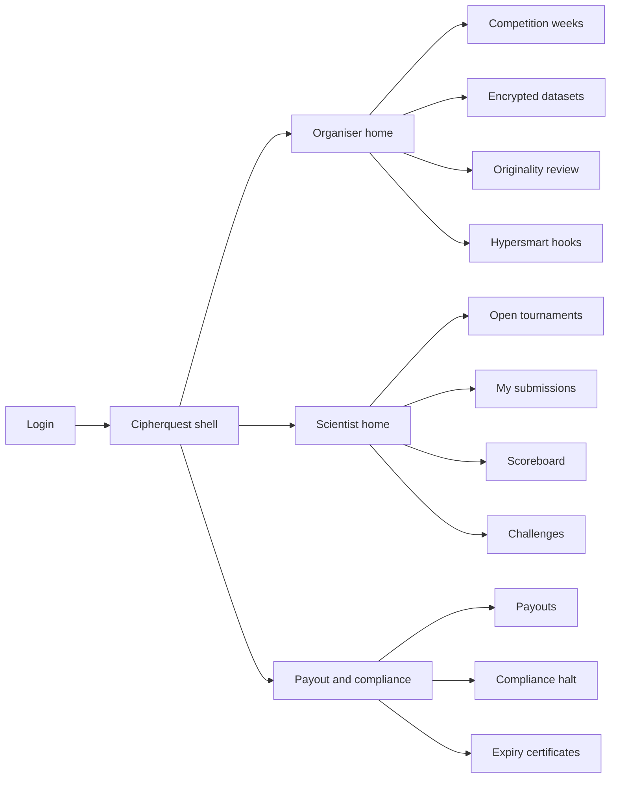
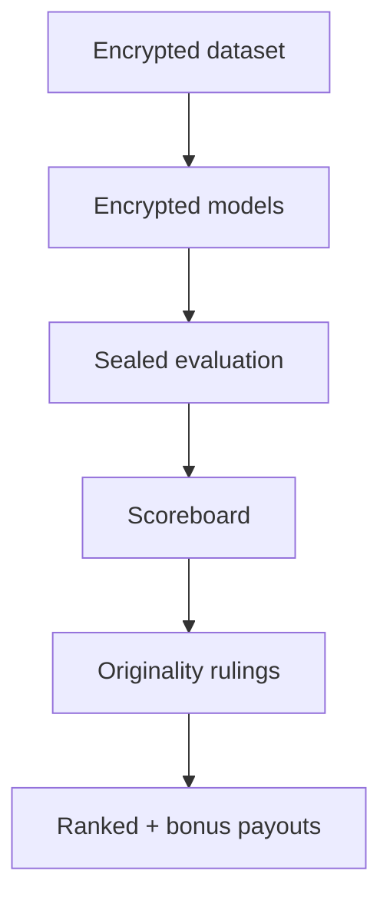

# Cipherquest — Web app

**Product:** [PRODUCT.md](./PRODUCT.md)
**Primary surface:** Dual-sided sealed tournament desk (Organiser workspace + Scientist workspace under one Cipherquest shell)
**Secondary surfaces:** Public/participant scoreboard (policy-gated); expiry certificate viewer for auditors
**Design thesis:** Cipherquest is a weekly sealed tournament floor — not an open Kaggle clone or freelance gig board. The UI metaphor is a cipher vault with a ranked payout table: datasets arrive encrypted with a ticking expiry; models stay encrypted IP; only scores and originality rulings feel public. Visual language is deep vault charcoal with cipher-cyan for sealed releases and originality-gold for bonus rulings. The brand wordmark sits as a quiet cipher seal on every payout and dataset screen so funds and labs know whose tournament neutrality they are trusting.

## UX research synthesis

### Category peers (best-in-class)

- **Numerai Tournament:** Weekly rounds, encrypted data, ranked payouts, staking/signal economics. Steal: weekly cadence chrome and payout-by-rank clarity; reject Numerai’s opaque meta-model mystique where Cipherquest needs auditable scoreboards and originality rulings.
- **Kaggle Competitions:** Rules, deadlines, leaderboards, notebook culture. Steal: pre-submit scoring definition visibility; reject open plaintext data dumps and winner-takes-IP norms.
- **Ocean Protocol / data marketplace consoles:** Dataset provenance, access control, time-bound access. Steal: provenance + ethical-sourcing attestations on each release; reject turning Cipherquest into a general data bazaar.
- **Gitcoin / crypto bounty desks:** Ranked payouts, transparent fee disclosure. Steal: top-N cut + disclosed take-rate before submit; reject social-quest aesthetics for quant labs.

### Patterns to adopt / reject

- **Adopt:** Encrypted-by-default dataset and model chips; expiry countdown with auditor certificate; top-N + originality bonus pools as separate lines; time-boxed score challenges without cleartext holdout; compliance halt banner; optional hypersmart hook panel (secondary).
- **Reject:** Public data download as default; blanket IP assignment to organiser; discretionary “originality tips”; purple AI marketplace glow; federated-device training as the home path (BR-7).

### Trust, density, and workflow constraints from PRODUCT.md

Organisers need sealed release with expiry that becomes operationally unreadable (BR-1, BR-11). Models remain scientist IP by default (BR-2). Payouts rank by accuracy with top-N (default 60) plus originality pool gated on documented rulings (BR-3, BR-4). Scoreboards must be auditable (BR-5). Provenance/ethics tags attach to releases (BR-6). Fee and currency rules are visible before submit (BR-9). Challenges never leak sealed holdout (BR-10). Compliance can block unlawful competitions (BR-12).

## Information architecture

### Nav model

### Roles → default home

| Role | Default home | Why |
|------|--------------|-----|
| Competition organiser | Organiser home — this week’s seal + payout draft | Weekly ops (BR-1, BR-3) |
| Data scientist | Open tournaments | Incentives before compute (BR-9) |
| Originality reviewer | Originality review queue | Bonus gate (BR-4) |
| Payout ops | Payouts | Dual-readable week close |
| Compliance / steward | Compliance + provenance | Lawful basis (BR-6, BR-12) |

### Cross-links to OpenAPI resources

| Nav area | OpenAPI tags / resources |
|----------|---------------------------|
| Tournament lifecycle | Competitions |
| Encrypted dataset release | Datasets |
| Encrypted model artefacts | Submissions |
| Ranking and evaluation | Scores |
| Ranked + originality payouts | Payouts |
| Score disputes | Challenges |

## Screen inventory

### Organiser home

- **Purpose:** Answer “is this week sealed, scored, and payout-drafted?” in one composition.
- **Entry:** Organiser login default.
- **Layout regions:** Brand + lab workspace; week clock; sealed dataset status + expiry; top-N payout draft; originality pending; compliance banner if blocked.
- **Primary actions:** Release dataset; close scoring; open originality; push payout draft.
- **Empty / loading / error:** Empty = create first weekly competition; error = eval worker unreachable.
- **BR / story ties:** BR-1, BR-3, BR-5.

### Competition week editor

- **Purpose:** Define scoring metrics, top-N cut, originality pool, payout currency, take-rate.
- **Entry:** Create / edit competition.
- **Layout regions:** Schedule; metric definition; top-N (default 60); originality pool; fee disclosure preview (scientist view); licence terms for scored artefacts.
- **Primary actions:** Publish rules; clone last week; attach compliance basis.
- **Empty / loading / error:** Missing lawful basis blocks publish (BR-12).
- **BR / story ties:** BR-3, BR-9, BR-12.

### Encrypted dataset release

- **Purpose:** Publish sealed data with expiry, provenance, and ethical-sourcing attestations.
- **Entry:** Week → Datasets.
- **Layout regions:** Cipher status; expiry countdown; provenance tags; ethical attestations; key custody summary (no key material display).
- **Primary actions:** Release; schedule expiry; issue expiry certificate after burn.
- **Empty / loading / error:** Expired = unreadable state with certificate CTA.
- **BR / story ties:** BR-1, BR-6, BR-11.

### Scientist open tournaments

- **Purpose:** Browse weeks with scoring definition, payout table, and fee rules before investing compute.
- **Entry:** Scientist default.
- **Layout regions:** Open weeks board; payout table preview; encrypted-data badge; IP-retention badge.
- **Primary actions:** Enter week; download sealed package; submit model.
- **Empty / loading / error:** Empty = no open sealed weeks.
- **BR / story ties:** BR-2, BR-9.

### Encrypted submission intake

- **Purpose:** Accept encrypted model artefacts that remain scientist IP by default.
- **Entry:** Week → Submit.
- **Layout regions:** Artefact upload; encryption attestation; licence grant scope to organiser (scored use only); fee acknowledgment.
- **Primary actions:** Submit; withdraw before close.
- **Empty / loading / error:** Reject plaintext upload when policy forbids.
- **BR / story ties:** BR-2, BR-9.

### Scoreboard

- **Purpose:** Auditable ranking tying submissions to scores and payout eligibility.
- **Entry:** Week → Scoreboard; public link if policy allows.
- **Layout regions:** Ranked table; metric columns; originality pending/ruled chips; payout draft amounts.
- **Primary actions:** Open evaluation definition; start challenge; export week board.
- **Empty / loading / error:** Scoring in progress = locked ranks.
- **BR / story ties:** BR-5, BR-3.

### Originality review

- **Purpose:** Documented ruling before originality bonuses settle.
- **Entry:** Organiser/reviewer queue.
- **Layout regions:** Candidate pairs; similarity evidence (policy-safe); ruling form; bonus eligibility impact.
- **Primary actions:** Rule eligible/ineligible; lock ruling; notify payouts.
- **Empty / loading / error:** Empty = no pending; unpaid bonus blocked until ruled.
- **BR / story ties:** BR-4.

### Challenge desk

- **Purpose:** Time-boxed score disputes with evaluation definition access — never cleartext holdout.
- **Entry:** Scientist scoreboard action; ops.
- **Layout regions:** Challenge queue; evaluation definition pane; sealed-holdout notice; resolution log.
- **Primary actions:** File challenge; resolve; re-score under same definition.
- **Empty / loading / error:** Expired window locked.
- **BR / story ties:** BR-10.

### Payouts

- **Purpose:** Dual-readable statement of ranks, originality rulings, amounts; retry rails without reopening scores.
- **Entry:** Payout ops default.
- **Layout regions:** Week statement; ranked vs originality lines; take-rate line; rail status; retry controls.
- **Primary actions:** Execute; retry failed; export finance pack.
- **Empty / loading / error:** Originality ungated = amber block on bonus line only.
- **BR / story ties:** BR-3, BR-4, BR-9.

### Compliance halt and hooks

- **Purpose:** Block competitions lacking lawful basis; optional hypersmart reverse-auction hooks.
- **Entry:** Compliance nav; admin hooks.
- **Layout regions:** Halt controls; provenance gaps; hook subscriptions (scoring/reverse-auction triggers) with “no plaintext on-chain” note.
- **Primary actions:** Halt/release; configure hook; test event.
- **Empty / loading / error:** Halted week shows coral on all participant views.
- **BR / story ties:** BR-8, BR-12.

## Key flows

1. **Weekly seal → score → pay** — release encrypted dataset → accept encrypted models → sealed eval → originality rulings → top-N + bonus payouts.

2. **Expiry** — countdown → key destruction → auditor certificate (BR-11).

3. **Score challenge** — file challenge → show eval definition only → resolve within time box (BR-10).

4. **Compliance halt** — steward flags missing lawful basis → halt week → no new submissions (BR-12).

5. **Hypersmart hook** — on-chain event → trigger off-chain scoring/reverse-auction notify without storing competition plaintext (BR-8).

## Design system

### Tokens (CSS variables)

- `--color-ink: #E6ECF2` — primary text
- `--color-vault-950: #0A0E14` — app ground
- `--color-vault-900: #131A24` — panels
- `--color-vault-700: #2A3444` — dividers
- `--color-cipher: #4EC4C8` — sealed / encrypted OK
- `--color-cipher-dim: #1A6A6E` — cipher on dark
- `--color-gold: #D4B45A` — originality bonus
- `--color-coral: #E0574F` — compliance halt / challenge overdue
- `--color-steel: #7A8FA3` — secondary labels
- `--color-brand: #9FCFD0` — Cipherquest wordmark
- `--font-display: "IBM Plex Sans", sans-serif`
- `--font-mono: "IBM Plex Mono", monospace` — submission ids, hashes, expiry certs
- `--space-1`…`--space-8`: 4px scale
- `--radius-sm: 4px`; `--radius-md: 8px`
- `--motion-seal: 200ms ease-out` — dataset sealed flash
- `--motion-expiry: 280ms ease-in-out` — expiry pulse
- `--motion-rank: 160ms ease-out` — scoreboard settle
- Atmosphere: subtle cipher-grid texture on vault-900; cool charcoal depth — not purple marketplace neon.

### Typography & brand

- Display for week titles and rank numerals; mono for artefact ids and expiry certificates.
- Brand wordmark on dataset, scoreboard, and payout screens.
- Login: brand hero; headline (“Compete sealed. Keep your IP.”); one CTA.

### Do / don’t

- **Do:** Keep models encrypted by default; separate originality rulings from accuracy rank; show take-rate before submit; issue expiry certificates.
- **Don’t:** Cleartext holdout in challenges; discretionary originality tips; Kaggle-open data as default; FL device farm as home.

### Accessibility & domain trust cues

- AA+ contrast; sealed/expired states include text + icons.
- Live regions for expiry and compliance halt.
- Focus: rules → dataset → submit → scoreboard → payout.

## Component patterns

- **SealedDatasetChip** — encrypted + expiry countdown.
- **IpRetainedBadge** — scientist owns encrypted artefact.
- **TopNPayoutTable** — accuracy ranks with cut line.
- **OriginalityRulingCard** — documented bonus gate.
- **ChallengeSafePane** — eval definition without holdout plaintext.
- **ExpiryCertificate** — auditor-facing unreadability proof.
- **TakeRateLine** — disclosed platform fee.
- **ComplianceHaltBanner** — blocks week operations.

## Out of scope for v1 web

- Mandatory federated on-device training UI; full OpenMined client; general data marketplace browse; supply-chain reverse-auction full product (hooks only); mobile-native trader apps; organiser MLOps IDE replacement.
